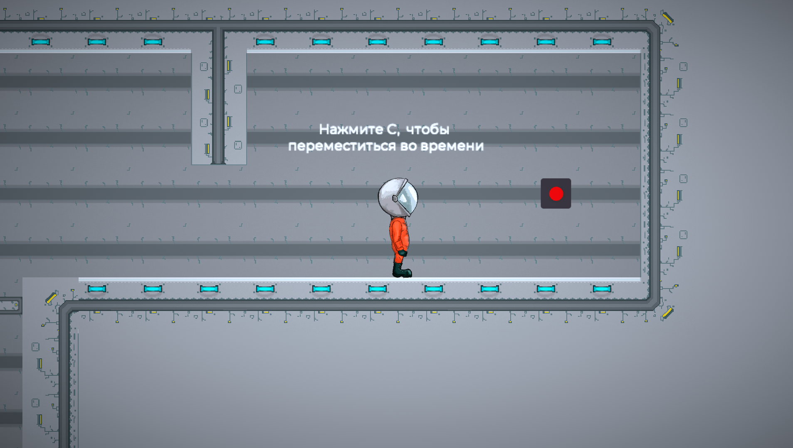
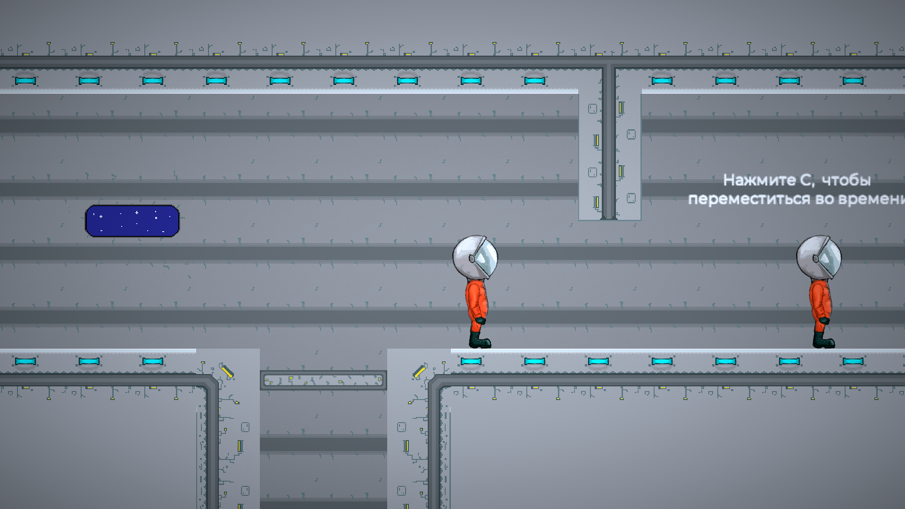
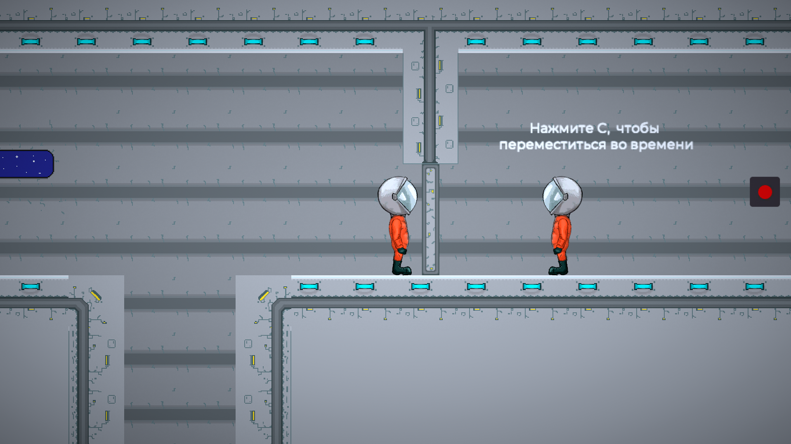
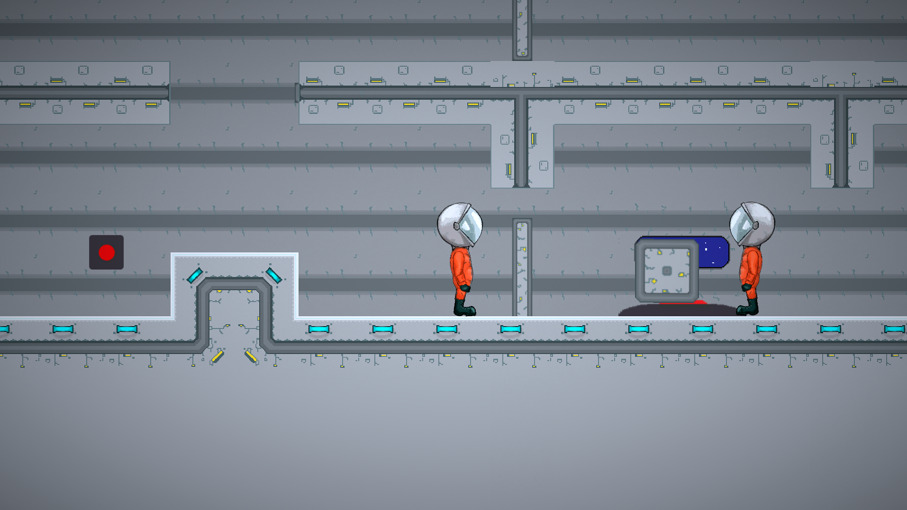

# TimeTaker

Данная игра была разработана на Unity и победила в гейм-джеме [CherryJam](https://practicingfutures.org/cherryjam?utm_source=hacklist)

## Геймплей 

Игроку необходимо проходить уровни, но в одиночку ему не справиться. К счастью, у героя есть способность - перемещаться во времени. Герой проходит часть уровня и возвращается во времени, после чего видит, как он из прошлого выполняет все те же действия, главное - не встретиться с ним, иначе произойдёт катастрофа.

## Скриншоты

## Попробовать игру

https://itch.io/jam/cherry-jam-by-kd/rate/706586 
## Авторы

- [Попов Виталий(@Totalexx)](https://github.com/Totalexx)
- [Кузин Данил(@Shambonik)](https://github.com/Shambonik)
